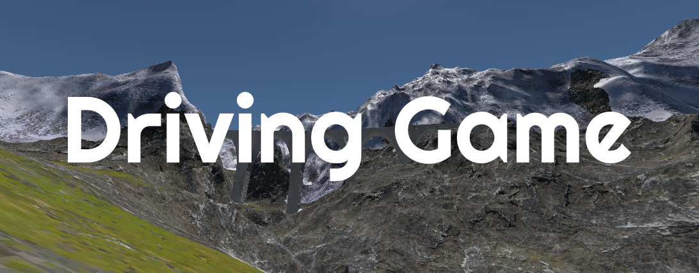
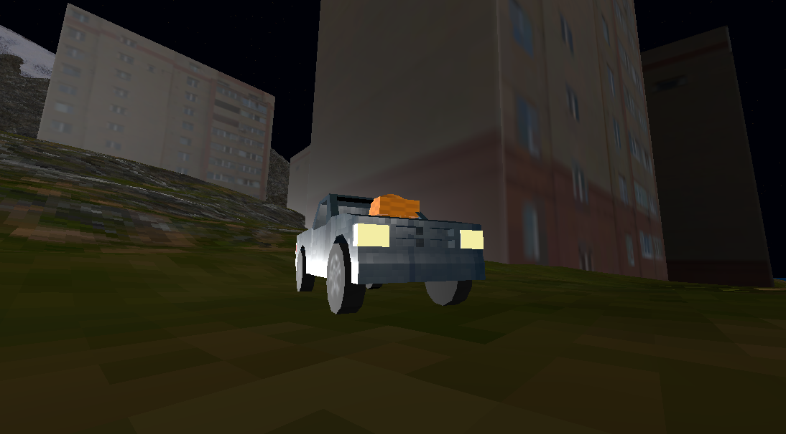
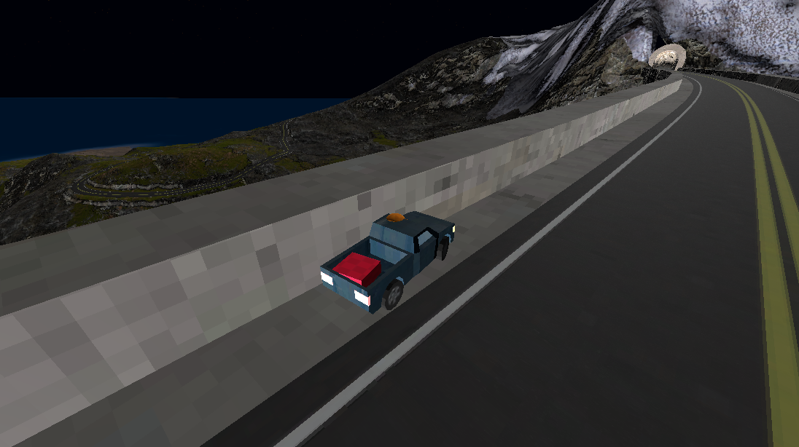
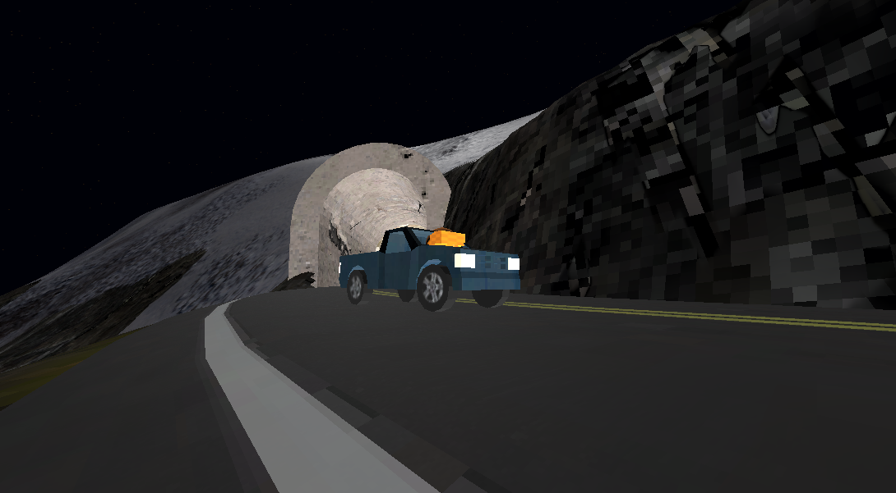
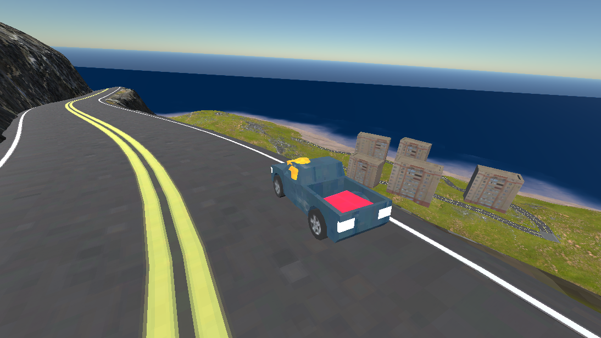
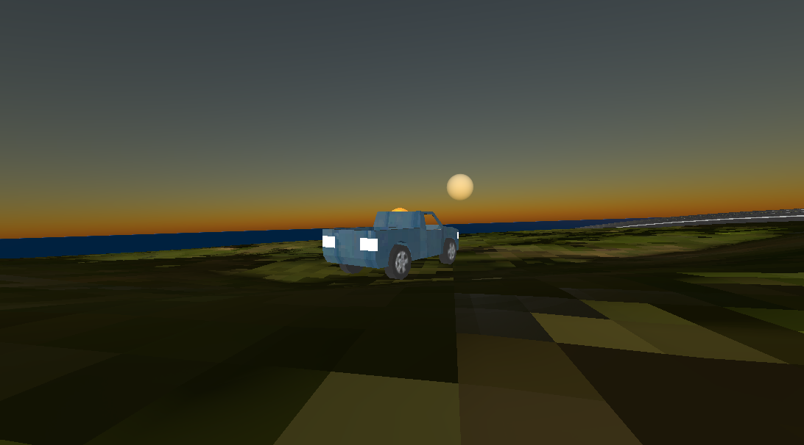

A very short game where it's just you, your car, and this package. You have one mission: deliver the package to beachtown, but where? that's for you to find out

This project is a part of a larger game i am working on: \
Check out the big idea here: https://github.com/FroggLeo/driving-game/blob/main/the_idea.md

## Installation Instructions
You have two ways of playing this game:

1. **Download the executable**
    * Find the latest release [here](https://github.com/FroggLeo/driving-game/releases) or on [itch.io](https://froggleo.itch.io/driving-game)
    * Download the zip file and extract
    * For Windows & Linux, make sure the all the extracted files stay in the same folder, then run the executable
    * For Mac, right click and select "Open", if that does not work, remove the quaratine and try again. If you get the following error:
      * `"libterrain.macos.debug" cannot be opened because the developer cannot be verified. macOS cannot verify that this app is free from malware.`
      * Running the following commands within the downloaded and unzipped directory appears to resolve the issue:
      * `$ xattr -dr com.apple.quarantine addons/terrain_3d/bin/libterrain.macos.debug.framework/libterrain.macos.debug`
      * `$ xattr -dr com.apple.quarantine addons/terrain_3d/bin/libterrain.macos.release.framework/libterrain.macos.release`
      * Check here for more information on running the Mac release: https://terrain3d.readthedocs.io/en/latest/docs/platforms.html#macos

2. **Play from the Godot engine:**
    * Clone the repository OR download zip file of the source code
    * Extract the file if needed
    * Open Godot Engine (v4.5.1 or higher), import the project
    * Click the play button at the top right corner

## Controls
  * Pause - Esc
  * Walk & Drive - W A S D
  * Zoom in - Scroll Up
  * Zoom out - Scroll Down
  * Rotate Camera - hold right click & move mouse
  * Sprint - Ctrl
  * Enter & Exit Car - E
  * Jump - Space

## More Screenshots
|  |  |
| :--- | :--- |
|  |  |
|  |  |

## Credits & Honorable Mentions
There are plugins and resources used in this project that came from the open source community, without them, this would not have been possible:
  * [Terrain3D by Tokisan Games](https://github.com/TokisanGames/Terrain3D)
  * [Godot Road Generator by TheDuckCow](https://github.com/TheDuckCow/godot-road-generator)
  * [Debug Draw 3D by DmitriySalnikov](https://github.com/DmitriySalnikov/godot_debug_draw_3d)
  * [Kenney Prototype Textures by Calinou](https://github.com/Calinou/kenney-prototype-textures)
  * [Godot Water Shader by Verssales](https://godotshaders.com/shader/another-water-shader/)

Most of my textures came from:
  * [Polyhaven](https://polyhaven.com/)
  * [AmbientCG](https://ambientcg.com/)

Tutorials that were very helpful:
  * [Raycast Car Vehicle Series by Octodemy](https://www.youtube.com/playlist?list=PLiRELyH-yJivTRnpjr0nHeGWncLiMmD2D)
  * [Terrain3D for Godot 4 by Tokisan Games](https://www.youtube.com/playlist?list=PLOVQ_NzPZeBY4rm7UAEakKiIbFovv_obF)

Other tools used:
  * [Blender](https://www.blender.org/)
  * [Gimp](https://www.gimp.org/)
  * [Godot](https://godotengine.org/)

This project was made for [Hack Club](https://hackclub.com/) as a part of [Milkyway](https://milkyway.hackclub.com/) and [Overglade](https://overglade.hackclub.com/)!
